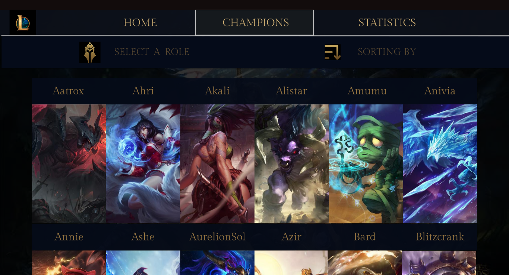

# Data Lovers

## Índice

* [Introducción](#introducción)
* [Definición deL Producto](#definición-del-producto)
* [Instrumento](#instrumento-de-investigación)
* [Historias de Usuario](#historias-de-usuario)
* [Diseño de la Interfaz de Usuario](#baja-y-alta-fidelidad)
* [Checklist](#checklist)

***

## Introducción

League of Legends (LOL) es un juego multijugador en el campo de batalla (MOBA). Este es un género de juegos relativamente nuevo que ha crecido en popularidad a lo largo de tiempo.

LOL consiste en 2 equipos, que constan de cinco jugadores cada uno, compitiendo entre sí en una carrera para destruir la estructura fortificada del equipo contrario en el extremo opuesto del mapa.
 
Desde su lanzamiento en el 2009, Riot Games, el desarrollador de LOL, ha podido presenciar la transformación de su juego en un deporte competitivo, y la inclusión de los eSports en la cultura general. En consecuencia, los jugadores se elevan al status de atletas y, al mismo tiempo, las experiencias del juego se convierten en espectáculos lo suficientemente atractivos como para atraer a grandes audiencias.

## Definición del Producto

Una página web donde se puede visualizar a todos los campeones con sus respectivos stats y skins principales. Adicionalmente, se tiene opciones de ordenado: A-Z, Z-A, Mayor Daño-Menor Daño y viceversa. Finalmente, hay una sección de estadística que muestre la media aritmética o promedio del nivel de ataque y dificultad por roles. 

El objetivo de esta página es ayudar a jugadores recientes, que lleven menos de 1 mes jugando "LOL", conocer al campeón que los impulsará al ranking "Challenger". 

## Instrumento de Investigación

El instrumento empleado ha sido una entrevista estructurada que se ha realizado de manera presencial. Se han aplicado las siguientes preguntas:

1.	Me podrías describir con tus propias palabras sobre “League of Legends”.
2.	¿Cuánto tiempo llevas jugando LOL? 
3.	¿Qué crees que lo hace diferente de otros juegos en línea?
4.	¿Crees haber desarrollado algunos “skills” en el ámbito cognitivo?
5.	¿Cómo iniciaste jugando LOL? ¿Alguien te lo recomendó o viste un anuncio y te decidiste a intentarlo?
6.	¿Qué característica del juego te impulso a seguir jugando?
7.	Con respecto al website oficial de LOL, ¿Cuándo quieres averiguar o constatar información es tu “go to” recurso?
8.	Si hubiera un website donde puedas ver todos los campeones, filtrarlos de una manera eficiente (roles, posiciones), ordenarlos no solo de la A-Z y Z-A, ¿Lo usarías?

## Historias de Usuario 

## Diseño de la Interfaz de Usuario

### Prototipo de Baja Fidelidad

#### Testeos de Usabilidad:
* En este primer prototipo, el usuario nos recomendó que la sección de los roles sería más entendible, si su ubicación fuera en la parte de superior de los campeones.
* El usuario le agradó la idea de una guia rápida dónde, con un click, pueda observar a los diferentes campeones y  caracteristicas respectivas de cada uno.

### Segunda Iteración de Prototipo de Baja Fidelidad.

#### Testeos de Usabilidad:
* El usuario no pudo comprender completamente las distintas opciones dadas para filtrar, debido a que se había combinado posiciones y roles.
* La presentación de los campeones fue aceptada por el usuario.
* El usuario recomendó, si es posible, ordenar los campeones de una manera no necesariamente convencional, es decir de la A-Z y Z-A.

### Prototipo de Alta Fidelidad

#### Ventana de "CHAMPIONS"

#### Testeos de Usabilidad
* 

Lo siguiente es diseñar tu Interfaz de Usuario (UI por sus siglas en inglés -
_User Interface_). Para eso debes aprender a utilizar alguna herramienta de
diseño visual. Nosotros te recomendamos [Figma](https://www.figma.com/) que es
una herramienta que funciona en el navegador y, además, puedes crear una cuenta
gratis. Sin embargo, eres libre de utilizar otros editores gráficos como
Illustrator, Photoshop, PowerPoint, Keynote, etc. Recuerda utilizar la identidad
gráfica correspondiente a cada set de datos que elijas.

El diseño debe representar el _ideal_ de tu solución. Digamos que es lo que
desearías implementar si tuvieras tiempo ilimitado para hackear. Además, tu
diseño debe seguir los fundamentos de _visual design_. También, deberás exportar
tu diseño a [Zeplin](https://zeplin.io/) y utilizar las especificaciones de
estilo que te dé Zeplin al momento de implementar tus diseños en código.

## Checklist

* [ ] Usa VanillaJS.
* [ ] No hace uso de `this`.
* [ ] Pasa linter (`npm run pretest`)
* [ ] Pasa tests (`npm test`)
* [ ] Pruebas unitarias cubren un mínimo del 70% de statements, functions y
  lines y branches.
* [ ] Incluye _Definición del producto_ clara e informativa en `README.md`.
* [ ] Incluye historias de usuario en `README.md`.
* [ ] Incluye _sketch_ de la solución (prototipo de baja fidelidad) en
  `README.md`.
* [ ] Incluye _Diseño de la Interfaz de Usuario_ (prototipo de alta fidelidad)
  en `README.md`.
* [ ] Incluye link a Zeplin en `README.md`.
* [ ] Incluye el listado de problemas que detectaste a través de tests de
  usabilidad en el `README.md`.
* [ ] UI: Muestra lista y/o tabla con datos y/o indicadores.
* [ ] UI: Permite ordenar data por uno o más campos (asc y desc).
* [ ] UI: Permite filtrar data en base a una condición.
* [ ] UI: Es _responsive_.