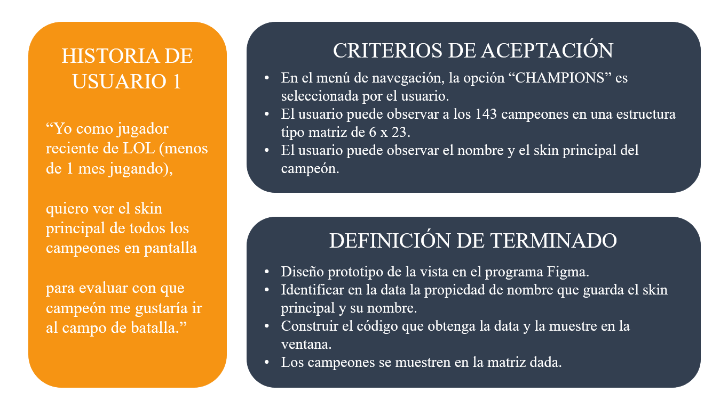
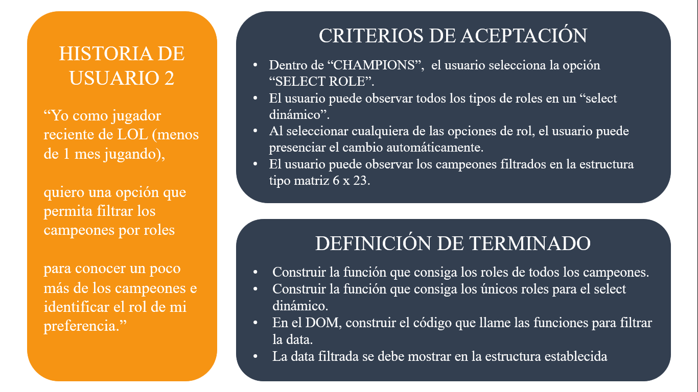
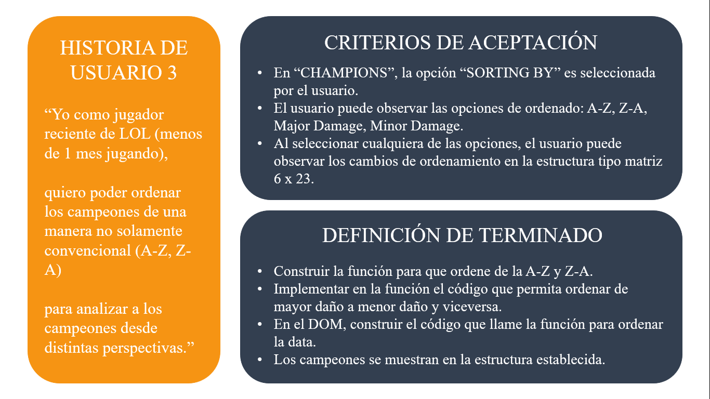
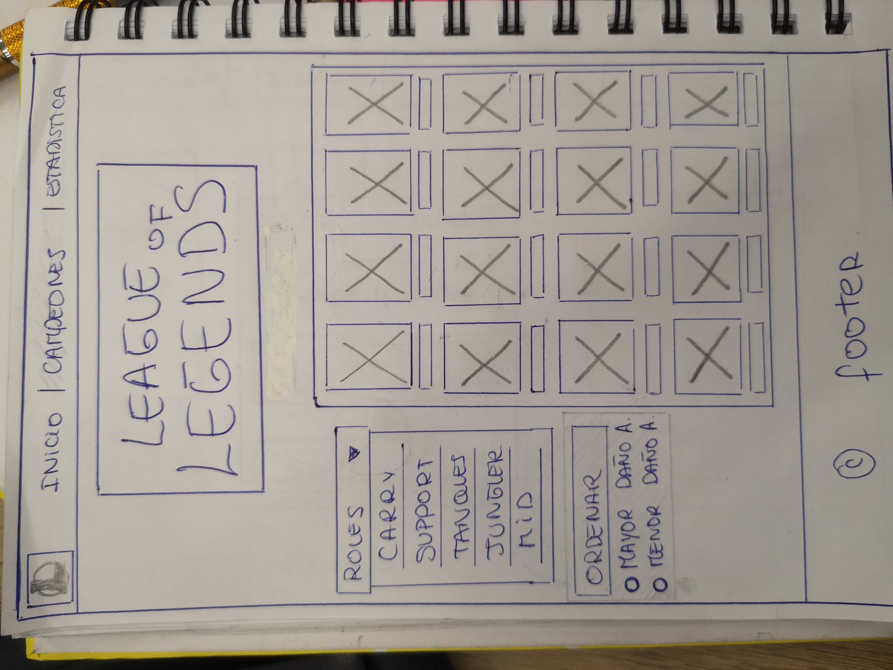
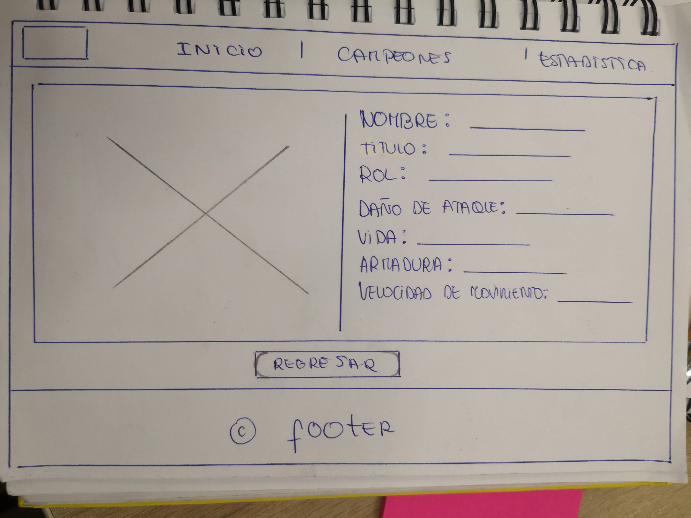
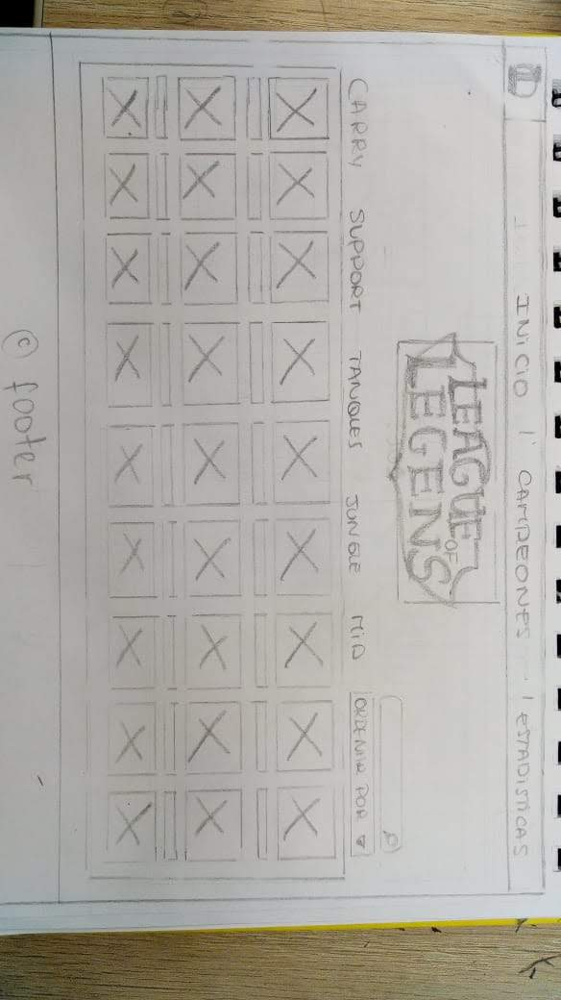

# Data Lovers

## Índice

* [Introducción](#introducción)
* [Definición deL Producto](#definición-del-producto)
* [Instrumento](#instrumento-de-investigación)
* [Historias de Usuario](#historias-de-usuario)
* [Diseño de la Interfaz de Usuario](#baja-y-alta-fidelidad)
* [Consideraciones técnicas](#consideraciones-técnicas)
* [Primeros pasos](#primeros-pasos)
* [Contenido de referencia](#contenido-de-referencia)
* [Checklist](#checklist)

***

## Introducción

League of Legends (LOL) es un juego multijugador en el campo de batalla (MOBA). Este es un género de juegos relativamente nuevo que ha crecido en popularidad a lo largo de tiempo.

LOL consiste en 2 equipos, que constan de cinco jugadores cada uno, compitiendo entre sí en una carrera para destruir la estructura fortificada del equipo contrario en el extremo opuesto del mapa.
 
Desde su lanzamiento en el 2009, Riot Games, el desarrollador de LOL, ha podido presenciar la transformación de su juego en un deporte competitivo, y la inclusión de los eSports en la cultura general. En consecuencia, los jugadores se elevan al status de atletas y, al mismo tiempo, las experiencias del juego se convierten en espectáculos lo suficientemente atractivos como para atraer a grandes audiencias.

## Definición del Producto

Una página web donde se puede visualizar a todos los campeones con sus respectivos stats y skins principales. Adicionalmente, se tiene opciones de ordenado: A-Z, Z-A, Mayor Daño-Menor Daño y viceversa. Finalmente, hay una sección de estadística que muestre la media aritmética o promedio del nivel de ataque y dificultad por roles. 

El objetivo de esta página es ayudar a jugadores recientes, que lleven menos de 1 mes jugando "LOL", conocer al campeón que los impulsará al ranking "Challenger". 

## Instrumento de Investigación

El instrumento empleado ha sido una entrevista estructurada que se ha realizado de manera presencial. Se han aplicado las siguientes preguntas:

1.	Me podrías describir con tus propias palabras sobre “League of Legends”.
2.	¿Cuánto tiempo llevas jugando LOL? 
3.	¿Qué crees que lo hace diferente de otros juegos en línea?
4.	¿Crees haber desarrollado algunos “skills” en el ámbito cognitivo?
5.	¿Cómo iniciaste jugando LOL? ¿Alguien te lo recomendó o viste un anuncio y te decidiste a intentarlo?
6.	¿Qué característica del juego te impulso a seguir jugando?
7.	Con respecto al website oficial de LOL, ¿Cuándo quieres averiguar o constatar información es tu “go to” recurso?
8.	Si hubiera un website donde puedas ver todos los campeones, filtrarlos de una manera eficiente (roles, posiciones), ordenarlos no solo de la A-Z y Z-A, ¿Lo usarías?

## Historias de Usuario 





## Diseño de la Interfaz de Usuario

#### Prototipo de baja fidelidad




##### Problemas de usabilidad:
* En este primer prototipo el usuario nos recomendo que los roles se verian mejor y mas entendibles en la parte de arriba de los campeones.
* Le parecio bien que sea una guia rapida ya que con un click en los diferentes campeones abre otra pagina con las caracteristicas de cada uno.
* Tambien nos recomendaron agregar un buscador ya que nuestros usuarios son jugadores que ya conocen los nombres de los campeones.

#### Segunda iteracion de prototipo de baja fidelidad.



#### Prototipo de alta fidelidad

Lo siguiente es diseñar tu Interfaz de Usuario (UI por sus siglas en inglés -
_User Interface_). Para eso debes aprender a utilizar alguna herramienta de
diseño visual. Nosotros te recomendamos [Figma](https://www.figma.com/) que es
una herramienta que funciona en el navegador y, además, puedes crear una cuenta
gratis. Sin embargo, eres libre de utilizar otros editores gráficos como
Illustrator, Photoshop, PowerPoint, Keynote, etc. Recuerda utilizar la identidad
gráfica correspondiente a cada set de datos que elijas.

El diseño debe representar el _ideal_ de tu solución. Digamos que es lo que
desearías implementar si tuvieras tiempo ilimitado para hackear. Además, tu
diseño debe seguir los fundamentos de _visual design_. También, deberás exportar
tu diseño a [Zeplin](https://zeplin.io/) y utilizar las especificaciones de
estilo que te dé Zeplin al momento de implementar tus diseños en código.

#### Testeos de usabilidad

Durante el reto deberás realizar tests de usabilidad con distintos usuarios, y
en base a los resultados de esos tests, deberás iterar tus diseños. Cuéntanos
qué problemas de usabilidad detectaste a través de los tests y cómo los
mejoraste en tu propuesta final.

### Implementación de la Interfaz de Usuario (HTML/CSS/JS)

Luego de diseñar tu interfaz de usuario deberás trabajar en su implementación.
Como mencionamos, **no** es necesario que construyas la interfaz exactamente
como la diseñaste. Tendrás un tiempo limitado para hackear, así es que deberás
priorizar.

Como mínimo, tu implementación debe:

1. Mostrar la data en una interfaz: puede ser un card, una tabla, una lista, etc.
2. Permitir al usuario filtrar y ordenar la data.
3. Calcular estadísticas de la colección (o subcolección) como media aritmética,
   máximo y/o mínimo de algún atributo numérico, o contar cuántas veces aparece
   un determinado valor, por ejemplo.
4. Ser _responsive_, es decir, debe visualizarse sin problemas desde distintos
tamaños de pantallas: móviles, tablets y desktops.

Es importante que tu interfaz, a pesar de ser una versión mínima de tu ideal,
siga los fundamentos de _visual design_.

### Pruebas unitarias

El _boilerplate_ de este proyecto no incluye Pruebas Unitarias (tests), así es
que  tendrás que escribir tu propias pruebas unitarias para las funciones
encargadas de _procesar_, _filtrar_ y _ordenar_ la data, así como _calcular_
estadísticas.

Tus Pruebas Unitarias deben dar una cobertura del 70% de _statements_ (_sentencias_), _functions_ (_funciones_), _lines_ (_líneas_), y _branches_ (_ramas_)
del archivo `src/data.js` que contenga tus Funciones y está detallado en la
sección [Data](###data) de las [Especificaciones Técnicas](##especificaciones-técnicas).

## Parte Opcional (Hacker edition)

Features/características extra sugeridas:

* En lugar de consumir la data estática brindada en este repositorio, puedes
  consumir la data de forma dinámica, cargando un archivo JSON por medio de
  `fetch`. La carpeta `src/data` contiene una versión `.js` y una `.json` de
  de cada set datos.
* Agregarle a tu interfaz de usuario implementada visualizaciones gráficas. Para
  ello te recomendamos explorar librerías de gráficas como [Chart.js](https://www.chartjs.org/)
  o [Google Charts](https://developers.google.com/chart/).
* 100% Coverage

## Consideraciones técnicas

La lógica del proyecto debe estar implementada completamente en JavaScript
(ES6), HTML y CSS. En este proyecto NO está permitido usar librerías o
frameworks, solo [vanilla JavaScript](https://medium.com/laboratoria-how-to/vanillajs-vs-jquery-31e623bbd46e),
con la excepción de librerías para hacer gráficas (charts); ver
[_Parte opcional_](#parte-opcional-hacker-edition) más arriba.

No se debe utilizar la _pseudo-variable_ `this`.

El _boilerplate_ contiene una estructura de archivos como punto de partida así
como toda la configuración de dependencias:

```text
.
├── package.json
├── README.md
├── src
│   ├── data (según con qué data trabajes)
│   │   ├── injuries
│   │   │   ├── injuries.js
│   │   │   └── injuries.json
│   │   ├── lol
│   │   │   ├── lol.js
│   │   │   └── lol.json
│   │   ├── pokemon
│   │   │   ├── pokemon.js
│   │   │   └── pokemon.json
│   │   ├── steam
│   │   │   ├── steam.js
│   │   │   └── steam.json
│   │   └── worldbank
│   │       ├── worldbank.js
│   │       └── worldbank.json
│   ├── data.js
│   ├── index.html
│   ├── main.js
│   └── style.css
└── test
    └── data.spec.js

8 directories, 17 files
```

### `src/index.html`

Como en el proyecto anterior, existe un archivo `index.html`. Como ya sabes,
acá va la página que se mostrará al usuario. También nos sirve para indicar
qué scripts se usarán y unir todo lo que hemos hecho.

En este archivo encontrarás una serie de _etiquetas_ (_tags_) `<script>`
_comentadas_. Para _cargar_ las diferentes fuentes de datos tendrás que
_descomentar_ estas _etiquetas_. Cada uno estos scripts asignará una variable
global con la data correspondiente a esa fuente de datos.

Por ejemplo, si "descomentamos" la siguiente línea:

```html
<!-- <script src="./data/worldbank/worldbank.js"></script> -->
```

La línea quedaría así:

```html
<script src="./data/worldbank/worldbank.js"></script>
```

Y ahora tendríamos la variable global `WORLDBANK` disponible en nuestros otros
scripts (como `src/data.js` o `src/main.js`).

### `src/main.js`

Recomendamos usar `src/main.js` para todo tu código que tenga que ver con
mostrar los datos en la pantalla. Con esto nos referimos básicamente a la
interacción con el DOM. Operaciones como creación de nodos, registro de
manejadores de eventos (_event listeners_ o _event handlers_), ....

Esta no es la única forma de dividir tu código, puedes usar más archivos y
carpetas, siempre y cuando la estructura sea clara para tus compañeras.

### `src/data.js`

El corazón de este proyecto es la manipulación de datos a través de arreglos
y objetos.

Te reomendamos que este archivo contenga toda la funcionalidad que corresponda
a obtener, procesar y manipular datos (tus funciones):

* `filterData(data, condition)`: esta función `filter` o filtrar recibiría la
  data, y nos retornaría aquellos datos que sí cumplan con la condición.

* `sortData(data, sortBy, sortOrder)`: esta función `sort` u ordenar
  recibe tres parámetros.
  El primer parámetro, `data`, nos entrega los datos.
  El segundo parámetro, `sortBy`, nos dice con respecto a cuál de los campos de
  la data se quiere ordenar.
  El tercer parámetro, `sortOrder`, indica si se quiere ordenar de manera
  ascendente o descendente.

* `computeStats(data)`: la función `compute` o calcular, nos permitirá hacer
  cálculos estadísticos básicos para ser mostrados de acuerdo a la data
  proporcionada.

Estos nombres de funciones y de parámetros son solamente referenciales, lo que
decidas depende de tu propia implementación.

Estas funciones deben ser [_puras_](https://medium.com/laboratoria-developers/introducci%C3%B3n-a-la-programaci%C3%B3n-funcional-en-javascript-parte-2-funciones-puras-b99e08c2895d)
e independientes del DOM. Estas funciones serán después usadas desde el archivo
`src/main.js`, al cargar la página, y cada vez que el usuario interactúe (click,
filtrado, ordenado, ...).

### `src/data`

En esta carpeta están los datos de las diferentes fuentes. Encontrarás una
carpeta por cada fuente, y dentro de cada carpeta dos archivos: uno con la
extensión `.js` y otro `.json`. Ambos archivos contienen la misma data; la
diferencia es que el `.js` lo usaremos a través de una etiqueta `<script>`,
mientras que el `.json` está ahí para opcionalmente cargar la data de forma
asíncrona con [`fetch()`](https://developer.mozilla.org/es/docs/Web/API/Fetch_API)
(ver sección de [_Parte Opcional_](#parte-opcional-hacker-edition)).

### `test/data.spec.js`

Tendrás también que completar las pruebas unitarias de las funciones
implementadas en el archivo `data.js`.

## Evaluación

Recuerda revisar la [rúbrica](https://docs.google.com/spreadsheets/u/1/d/e/2PACX-1vRktPN4ilZtkRN5tUb3DVhgeihwlzk63_-JI3moA-bXpKDbHDioAK2H3qbrwWNb0Ql4wX22Tgv7-PDv/pubhtml)
para ver la descripción detallada de cada habilidad y cada nivel. Esta es una
lista de todas las habilidades involucradas en este proyecto y que evaluaremos
cuando lo completes:

### General

| Característica/Habilidad |
|--------------------------|
| Completitud |

### Habilidades Blandas

| Habilidad |
|-----------|
| Planificación, organización y manejo del tiempo |
| Autoaprendizaje |
| Presentaciones |
| Adaptabilidad |
| Solución de problemas |
| Trabajo en equipo |
| Responsabilidad |
| Dar y recibir feedback |
| Comunicación eficaz |

### Tech

| Habilidad |
|-----------|
| **Computer Science** |
| Lógica |
| Arquitectura |
| **Source Control Management** |
| Git |
| GitHub |
| **JavaScript** |
| Estilo |
| Nomenclatura/semántica |
| Funciones/modularidad |
| Estructuras de datos |
| Tests |
| **HTML** |
| Validación |
| Estilo |
| Semántica |
| **CSS** |
| DRY |
| Responsive |

### UX

| Habilidad |
|-----------|
| **Investigación (_Reseacrh_)** |
| User Centricity (_Diseño Centrado en el Usuario_)|
| Entrevistas |
| Pruebas (_tests_) de usabilidad|
| **Diseño Visual (_Visual Design_)** |
| Contraste |
| Alineación |
| Jerarquía |
| Tipografía |
| Color |

***

## Pistas sobre cómo empezar a trabajar en el proyecto

Antes de empezar a escribir código, debes definir qué deberá hacer el producto
en base al conocimiento que puedas obtener de tu usuario. Estas preguntas te
pueden ayudar:

* ¿Quiénes son los principales usuarios de producto?
* ¿Cuáles son los objetivos de estos usuarios en relación con el producto?
* ¿Cuáles son los datos más relevantes que quieren ver en la interfaz y por qué?
* ¿Cuándo utilizan o utilizarían el producto?
* Toda tu investigación previa debe tener como resultado todas las Historias
de Usuario de tu proyecto.
* No hagas los prototipos de alta fidelidad de todas tus Historias. Comienza
solamente por los que se necesiten para tu Sprint 1 (semana 1 de trabajo). Más
pistas en la guía de organización para el proyecto.

Cuando ya estés lista para codear, te sugerimos empezar de esta manera:

1. Una de las integrantes del equipo debe realizar un :fork_and_knife:
   [fork](https://help.github.com/articles/fork-a-repo/) del repo de tu cohort,
   tus _coaches_ te compartirán un _link_ a un repo y te darán acceso de lectura
   en ese repo. La otra integrante del equipo deber hacer un fork **del
   repositorio de su compañera** y [configurar](https://gist.github.com/BCasal/026e4c7f5c71418485c1)
   un `remote` hacia el mismo.
2. :arrow_down: [Clona](https://help.github.com/articles/cloning-a-repository/)
   tu _fork_ a tu computadora (copia local).
3. 📦 Instala las dependencias del proyecto con el comando `npm install`. Esto
   asume que has instalado [Node.js](https://nodejs.org/) (que incluye [npm](https://docs.npmjs.com/)).
4. Si todo ha ido bien, deberías poder ejecutar las :traffic_light:
   pruebas unitarias (unit tests) con el comando `npm test`.
5. A codear se ha dicho! :rocket:

***

## Contenido de referencia

### Diseño de experiencia de usuario (User Experience Design)

* Investigación con usuarios / entrevistas
* Principios de diseño visual

### Desarrollo Front-end

* Unidad de testing en curso de JavaScript en LMS.
* Unidad de arreglos en curso de JavaScript en LMS.
* Unidad de objetos en curso de JavaScript en LMS.
* Unidad de funciones en curso de JavaScript en LMS.
* Unidad de DOM en curso de Browser JavaScript en LMS.
* [Array en MDN](https://developer.mozilla.org/es/docs/Web/JavaScript/Referencia/Objetos_globales/Array)
* [Array.sort en MDN](https://developer.mozilla.org/es/docs/Web/JavaScript/Referencia/Objetos_globales/Array/sort)
* [Array.map en MDN](https://developer.mozilla.org/es/docs/Web/JavaScript/Referencia/Objetos_globales/Array/map)
* [Array.filter en MDN](https://developer.mozilla.org/es/docs/Web/JavaScript/Referencia/Objetos_globales/Array/filter)
* [Array.reduce en MDN](https://developer.mozilla.org/es/docs/Web/JavaScript/Referencia/Objetos_globales/Array/reduce)
* [Array.forEach en MDN](https://developer.mozilla.org/es/docs/Web/JavaScript/Referencia/Objetos_globales/Array/forEach)
* [Object.keys en MDN](https://developer.mozilla.org/es/docs/Web/JavaScript/Referencia/Objetos_globales/Object/keys)
* [Object.entries en MDN](https://developer.mozilla.org/es/docs/Web/JavaScript/Referencia/Objetos_globales/Object/entries)
* [Fetch API en MDN](https://developer.mozilla.org/en-US/docs/Web/API/Fetch_API)
* [json.org](https://json.org/json-es.html)

### Herramientas

* [Git](https://git-scm.com/)
* [GitHub](https://github.com/)
* [GitHub Pages](https://pages.github.com/)
* [Node.js](https://nodejs.org/)
* [Jest](https://jestjs.io/)

### Organización del Trabajo:

* [Historias de Usuario](https://www.youtube.com/watch?v=ky6wFiF5vMk&t=344s). Ojo que Cris no diferencia _Definición de terminado_ de
_Criterios de Aceptación_ y nosotros sí lo haremos. Más detalles en la guía.
* [Cómo dividir H.U.](https://www.youtube.com/watch?v=Ueq786iZ30I&t=341s)
* [Guía para Data Lovers](https://docs.google.com/presentation/d/e/2PACX-1vQhx9D36NjpH-Daea-ITPUDUzNL8ZiNAprq_7b5PSUrfutk45tEtaOLz2lmd8f54_5jX1hypDM8f8SM/pub?start=false&loop=false&delayms=60000)

***

## Checklist

* [ ] Usa VanillaJS.
* [ ] No hace uso de `this`.
* [ ] Pasa linter (`npm run pretest`)
* [ ] Pasa tests (`npm test`)
* [ ] Pruebas unitarias cubren un mínimo del 70% de statements, functions y
  lines y branches.
* [ ] Incluye _Definición del producto_ clara e informativa en `README.md`.
* [ ] Incluye historias de usuario en `README.md`.
* [ ] Incluye _sketch_ de la solución (prototipo de baja fidelidad) en
  `README.md`.
* [ ] Incluye _Diseño de la Interfaz de Usuario_ (prototipo de alta fidelidad)
  en `README.md`.
* [ ] Incluye link a Zeplin en `README.md`.
* [ ] Incluye el listado de problemas que detectaste a través de tests de
  usabilidad en el `README.md`.
* [ ] UI: Muestra lista y/o tabla con datos y/o indicadores.
* [ ] UI: Permite ordenar data por uno o más campos (asc y desc).
* [ ] UI: Permite filtrar data en base a una condición.
* [ ] UI: Es _responsive_.